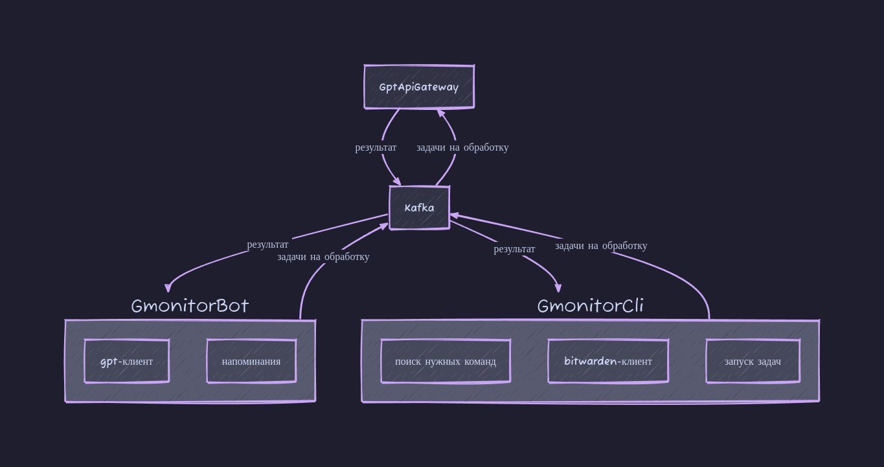

# GmonitorBot
## Cli-клиент для работы с API Groq

## Архитектура


## Стек
- Python 3.13
- FastStream
## Установка
Для установки утилиты необходимы:
- Установленный [pipx](https://pipx.pypa.io/stable/installation/)
- Поднятая Kafka с подключенным [gmonitor-api-gateway](https://github.com/GalinaMonitor/gmonitor-api-gateway)
```bash
pipx install git+https://github.com/GalinaMonitor/gmonitor-all.git
export GMONITOR_CLI_KAFKA_HOST=<Хост Kafka>
export GMONITOR_CLI_KAFKA_PORT=<Порт Kafka>
```
Экспорты для удобства можно занести в файл конфигурации оболочки (`~/.bashrc` или `~/.zshrc`):

## Пример использования

### Стандартный режим. Запрос для получения команды для linux-терминала.
```bash
$ gmonitorcli поменять владельца директории на custom

Команда 'chown custom:custom /путь/к/директории' скопирована в буфер обмена
```
### Базовый режим. Запросы напрямую к gpt.
```bash
$ gmonitorcli -b сколько километров до луны

Ответ: Расстояние до Луны составляет примерно 384 400 километров (238 900 миль).
```
